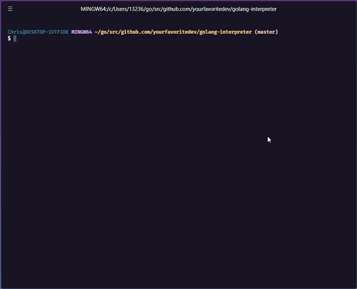

An interpreter written in Go that parses and evaluates a psuedo JavaScript language. The interpreter implements a tree-walking algorithm to recursively navigate all nodes in the abstract syntax tree. Controls are in place to handle invalid input at time of execution.

## Installation

`git clone git@github.com:yourfavoritedev/Go-Interpreter.git`

## Getting Started

1. From the root of this directory simply run the app:
   `go run .`
2. You will be prompted to provide input to the interpreter.

## Demo

